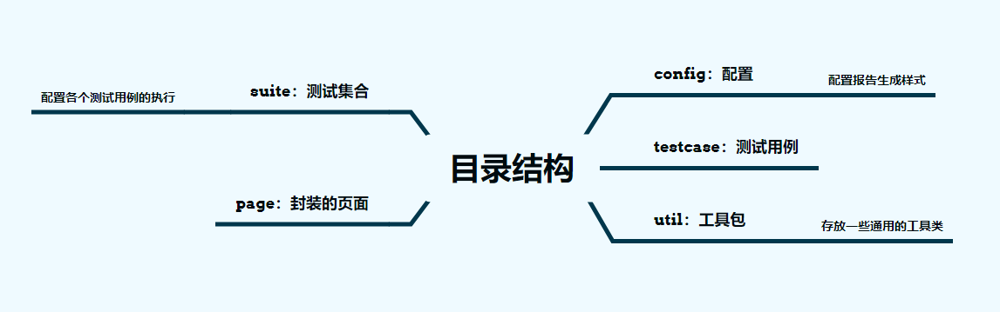

## 自动化实施方案Demo

### 1. 概述
 此项目为webUI自动化demo，后面有时间的话再集成接口自动化一起.
 整个项目的思想是采用PO的设计模式，利用面对对象的思想，把每个看到的页面封装成类；再封装页面的操作方法，实现高可用的复用逻辑。

### 2. 设计思路
初步实现方案：jenkins + testng + selenium + extentReports ；
<ul>
    <li>jenkins通过mvn调用testng的suite执行测试用例</li>
    <li>测试用例实现：1) UI自动化采用selenium执行。设计模式拟使用po。
      2) 接口自动化的话用httpclient应该可以。
    </li>
    <li>测试报告用testng的IReporter监听器生成，集成extentReport框架美化。</li>
    <li></li>
</ul>

#### maven运行命令如下：
注意：pom文件指定的xml路径要对应上

```1. mvn clean test -DTestNG.xml=src/TestNG.xml   //-D指定环境变量```

若需要在jenkins上构建时运行，选择构建后运行命令即可。

### 3. 目录结构介绍


### 4. 

